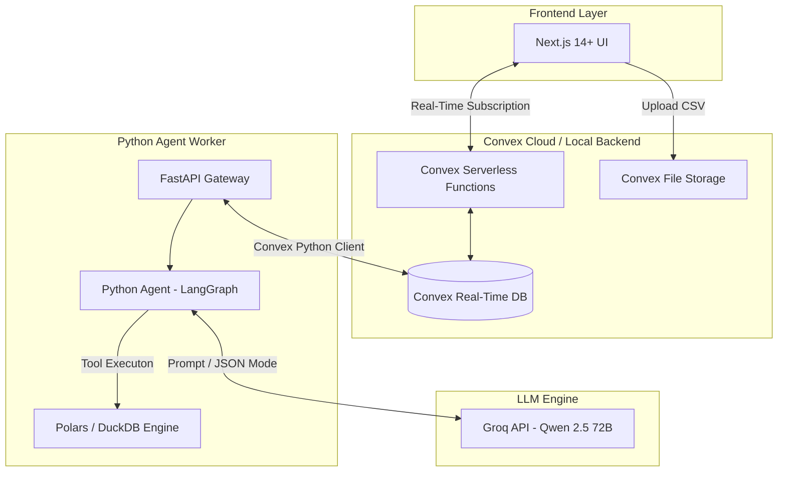

# AutoInsight AI — Convex & Groq Integration Blueprint
**Document Version:** 1.0  
**Date:** June 6, 2026  
**Subject:** Transitioning to Convex Real-Time Database & Groq Agent Orchestration

---

## 1. Executive Summary

This report outlines the technical strategy to modernize the **AutoInsight AI** architecture by replacing the local PostgreSQL database, Redis caching queue, and MinIO file storage with **Convex**. The AI Agentic processing framework will continue to use **Groq** (with Qwen 2.5 72B) as its primary language model.

This hybrid architecture leverages:
* **Convex** for real-time frontend data synchronization, user authentication, schema-enforced document storage, and file storage.
* **Groq** for high-speed, low-latency, and zero-cost Agentic LLM reasoning.
* **Python Backend** as an isolated computational worker executing Polars/DuckDB math operations.

---

## 2. High-Level Architecture

The system operates as a tri-tier architecture. Below is the data flow showing how Next.js, Convex, the Python backend, and Groq communicate:



---

## 3. Convex Database Schema (`convex/schema.ts`)

Convex uses a TypeScript file to define its database schema and index fields. Below is the schema that replaces all PostgreSQL DDL tables:

```typescript
import { defineSchema, defineTable } from "convex/server";
import { v } from "convex/values";

export default defineSchema({
  // Users & Authentication
  users: defineTable({
    name: v.string(),
    email: v.string(),
    role: v.union(v.literal("admin"), v.literal("analyst"), v.literal("viewer")),
    isActive: v.boolean(),
    lastLoginAt: v.optional(v.string()),
  }).index("by_email", ["email"]),

  // Pipeline Execution Tracking
  pipelines: defineTable({
    userId: v.id("users"),
    status: v.union(
      v.literal("queued"),
      v.literal("running"),
      v.literal("completed"),
      v.literal("failed"),
      v.literal("cancelled")
    ),
    fileName: v.string(),
    fileSize: v.number(),
    stagesCompleted: v.array(v.string()),
    totalProcessingTimeMs: v.optional(v.number()),
    storageId: v.string(), // ID pointing to Convex File Storage
    error: v.optional(v.string()),
  }).index("by_status", ["status"]),

  // Unified Data Models (Stage 3 & 4 Results)
  dataModels: defineTable({
    pipelineId: v.id("pipelines"),
    modelJson: v.string(), // Enriched schema metadata JSON
    confidenceAvg: v.number(),
    columnCount: v.number(),
    rowCount: v.number(),
  }).index("by_pipeline", ["pipelineId"]),

  // Analytical Reports Index
  reports: defineTable({
    dataModelId: v.id("dataModels"),
    title: v.string(),
    reportBundle: v.string(), // Stringified ReportBundle JSON
    overallConfidence: v.number(),
    pdfUrl: v.optional(v.string()),
    htmlUrl: v.optional(v.string()),
  }).index("by_dataModel", ["dataModelId"]),

  // Conversations (NLQ Chat)
  conversations: defineTable({
    userId: v.id("users"),
    pipelineId: v.id("pipelines"),
    messages: v.array(
      v.object({
        sender: v.union(v.literal("user"), v.literal("agent")),
        text: v.string(),
        timestamp: v.string(),
      })
    ),
  }),
});
```

---

## 4. Python Backend Integration

The Python backend connects to Convex using the official `convex` package. The FastAPI app acts as a **service client** rather than a primary database controller.

### 4.1 Initializing the Client
In [backend/database.py](file:///d:/mvk%20data%20analyasis/source%20code/backend/database.py), we initialize the synchronous/asynchronous Convex client:

```python
import os
from convex import ConvexClient

class ConvexDBManager:
    def __init__(self):
        self.url = os.getenv("CONVEX_URL")
        if not self.url:
            raise ValueError("CONVEX_URL environment variable is not configured!")
        self.client = ConvexClient(self.url)

    def get_pending_pipelines(self):
        """Fetch all queued pipeline tasks from Convex."""
        return self.client.query("pipelines:getPending")

    def update_pipeline_status(self, pipeline_id: str, status: str, progress: list):
        """Update progress in real-time."""
        self.client.mutation(
            "pipelines:updateStatus", 
            {"id": pipeline_id, "status": status, "stagesCompleted": progress}
        )

    def store_data_model(self, pipeline_id: str, model_data: dict, confidence: float):
        """Save inferred schema and relationships."""
        self.client.mutation(
            "dataModels:create",
            {
                "pipelineId": pipeline_id,
                "modelJson": json.dumps(model_data),
                "confidenceAvg": confidence,
                "columnCount": len(model_data.get("cleaned_columns", [])),
                "rowCount": model_data.get("row_count", 0)
            }
        )
```

---

## 5. Groq Agentic Loop Flow

The Python agent leverages Groq speed to quickly perform data reasoning. Below is the code lifecycle for relationship discovery using this setup:

```python
from langchain_core.prompts import PromptTemplate
from langchain_groq import ChatGroq
from pydantic import BaseModel, Field

# 1. Define Strict Output Schema
class ColumnRelationship(BaseModel):
    source: str = Field(description="Primary key column")
    target: str = Field(description="Foreign column relationship")
    confidence: float = Field(description="Confidence score between 0.0 and 1.0")
    reasoning: str = Field(description="Explanation of relationship")

# 2. Setup Groq with Qwen 2.5 72B
llm = ChatGroq(
    temperature=0.1,
    groq_api_key=os.getenv("GROQ_API_KEY"),
    model_name="qwen-2.5-72b"
)
structured_llm = llm.with_structured_output(ColumnRelationship)

# 3. Execution Function
async def discover_relationships(schema_info: str) -> ColumnRelationship:
    prompt = PromptTemplate.from_template(
        "Analyze the following database schema and find logical connections:\n{schema_info}"
    )
    chain = prompt | structured_llm
    result = await chain.ainvoke({"schema_info": schema_info})
    return result
```

---

## 6. Deployment & Migration Step-by-Step

To set up this architecture, perform the following steps:

### Step 1: Convex Setup
1. Install Convex CLI globally:
   ```bash
   npm install -g convex
   ```
2. Navigate to your frontend folder and initialize Convex:
   ```bash
   cd autoinsight-ai/frontend
   npx convex dev
   ```
   *This will prompt you to login to Convex, create a new project, and configure a deployment in the cloud.*

### Step 2: Configure Environment Variables (`.env`)
Update your backend environment variables to include the Convex URLs:
```env
# Convex Settings
CONVEX_URL=https://your-project-name.convex.cloud
CONVEX_DEPLOY_KEY=your_deploy_key_here

# Groq Settings
GROQ_API_KEY=gsk_your_groq_api_key_here
```

### Step 3: Launch Docker Services
Modify your `docker-compose.yml` to run the FastAPI API and Celery workers, utilizing Convex for storage. Launch using:
```bash
docker-compose up --build -d
```

---

## 7. Comparison: Before vs. After Migration

| Feature | Old Architecture | New Architecture (Convex + Groq) |
|---|---|---|
| **Database** | Local PostgreSQL Container | Serverless Convex Database (Cloud or Local) |
| **File Storage** | MinIO Container (S3 Simulation) | Convex File Storage (Cloud Native) |
| **Real-time Sync** | Server-Sent Events (SSE) / Polling | Convex Reactive Subscriptions (Automatic) |
| **Migrations** | Custom Python script `migrate.py` | Schema declared dynamically in TypeScript |
| **AI Processing** | Qwen (Groq) & Llama (Local Ollama) | Groq-Exclusive (Optimized for speed and zero-cost) |
| **Auth** | Custom JWT Token Auth | Convex + Clerk Auth Integration |

---

*End of Report*  
*Document prepared for MVK Data Analysis — Convex & Groq Integration Plan.*
