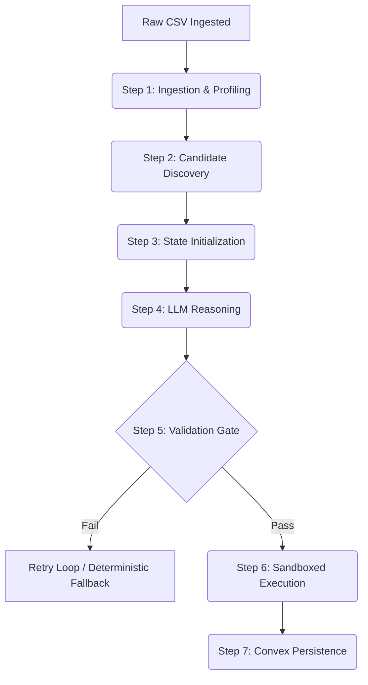

# AutoInsight AI — Step-by-Step Relationship Code Analysis

This report provides a step-by-step technical analysis of how the codebase discovers, validates, and processes relationships between data columns. It details the role of each source file and tracks how the variables flow from stage to stage.

---

## The Step-by-Step Relationship Lifecycle

When you upload a dataset, it progresses through a pipeline orchestrated by **[orchestrator.py](file:///d:/mvk%20data%20analyasis/source%20code/backend/pipeline/orchestrator.py)**. The discovery of relationships occurs in **Stage 3** of this pipeline.

Here is the exact code journey:



---

## Step 1: Ingestion & Profiling
* **Files involved:** 
  * [stage1_csv_to_json.py](file:///d:/mvk%20data%20analyasis/source%20code/backend/pipeline/stage1_csv_to_json.py)
  * [tools.py](file:///d:/mvk%20data%20analyasis/source%20code/backend/tools.py)
* **What happens in code:**
  * When a CSV is uploaded, it is read into memory as a **Polars DataFrame** (`pl.DataFrame`).
  * The method `profile_schema` in **[tools.py](file:///d:/mvk%20data%20analyasis/source%20code/backend/tools.py#L307-L364)** iterates through all columns, computing:
    * `cardinality` (number of unique values).
    * `null_count` and `null_percentage`.
    * A boolean `is_numeric` (flagging float and integer columns).
    * A boolean `is_categorical` (columns with $\le 20$ unique values).

---

## Step 2: Candidates Generation (Pearson/Spearman/Overlaps)
* **Files involved:**
  * [tools.py](file:///d:/mvk%20data%20analyasis/source%20code/backend/tools.py#L586-L680) ➔ `discover_relationship_candidates()`
* **What happens in code:**
  * To prevent wasting time asking the LLM to inspect random column pairs, Python filters candidates using pure mathematics first.
  * **Linear relationships:** `compute_pearson()` calculates Pearson correlation coefficients ($r$) for numeric columns.
  * **Non-linear relationships:** `compute_spearman()` calculates Spearman rank correlations.
  * **Foreign Key indicators:** `compute_value_overlap()` checks if categorical or text columns share values (e.g. comparing ID columns).
  * **Filtering:** If a pair has $|r| \ge 0.5$ or a value overlap ratio $\ge 0.3$, it is labeled as a relationship candidate.

---

## Step 3: State Initialization
* **Files involved:**
  * [stage3_langgraph_agent.py](file:///d:/mvk%20data%20analyasis/source%20code/backend/pipeline/stage3_langgraph_agent.py#L99-L120) ➔ `AgentState` class
* **What happens in code:**
  * The orchestrator passes the Polars DataFrame to the `Stage3_LangGraphAgent`.
  * An instance of `AgentState` is created:
    ```python
    state = AgentState(df)
    ```
  * This state object acts as a shared memory bag. It accumulates the schema profile from Node 1, relationship candidates from Node 2, and eventually stores the LLM findings.

---

## Step 4: AI Reasoning
* **Files involved:**
  * [stage3_langgraph_agent.py](file:///d:/mvk%20data%20analyasis/source%20code/backend/pipeline/stage3_langgraph_agent.py#L441-L514) ➔ `reason_step()`
  * [llm_factory.py](file:///d:/mvk%20data%20analyasis/source%20code/backend/llm_factory.py#L190-L325) ➔ `LLMFactory.invoke_agent()`
* **What happens in code:**
  * `reason_step` formats three variables into a JSON string: `schema_metadata`, `candidates_summary`, and `statistics`.
  * It requests the `core_agent_system` prompt template from **[prompt_registry.py](file:///d:/mvk%20data%20analyasis/source%20code/backend/prompt_registry.py)**.
  * The prompt tells the LLM to filter, classify (e.g. `one-to-many`), rate (assign confidence), and recommend derived columns.
  * It invokes the LLM using:
    ```python
    response = await self.llm_factory.invoke_agent(
        system_prompt=system_prompt,
        user_prompt=user_prompt,
        output_model=self._create_output_model(),
    )
    ```
  * The LLM responds in JSON which is parsed back into a Python object by Pydantic.

---

## Step 5: The Validation Gate
* **Files involved:**
  * [stage3_langgraph_agent.py](file:///d:/mvk%20data%20analyasis/source%20code/backend/pipeline/stage3_langgraph_agent.py#L515-L591) ➔ `_validate_gate()`
  * [stage3_langgraph_agent.py](file:///d:/mvk%20data%20analyasis/source%20code/backend/pipeline/stage3_langgraph_agent.py#L593-L682) ➔ `_fallback_reason_step()`
* **What happens in code:**
  * The code runs `_validate_gate(state)` to verify safety and confidence thresholds:
    1. **Min Count:** Check that there is at least one relationship.
    2. **Confidence Threshold:** Check if all returned relationships have a confidence score $\ge 0.70$ (from settings).
    3. **Syntax Validation:** Verifies that no columns referenced in relationships are missing from the dataset.
  * **If passed:** State is updated with `validation_status = "passed"` and continues to execution.
  * **If failed:**
    * Retries up to 3 times.
    * If all retries fail, it triggers `_fallback_reason_step()`, which deterministically creates relationships using Pearson correlation and overlaps directly in Python with no LLM cost.

---

## Step 6: Sandboxed Execution & Assembly
* **Files involved:**
  * [stage3_langgraph_agent.py](file:///d:/mvk%20data%20analyasis/source%20code/backend/pipeline/stage3_langgraph_agent.py#L737-L800) ➔ `executor_step()`
  * [tools.py](file:///d:/mvk%20data%20analyasis/source%20code/backend/tools.py#L168-L300) ➔ `safe_eval_polars()`
* **What happens in code:**
  * The agent checks the derived columns list recommended by the LLM.
  * For each derived column, the code passes the math formula string to `safe_eval_polars`.
  * `safe_eval_polars` parses the expression into a Python AST tree (`ast.parse()`), loops through every node, and raises a `SandboxViolation` if it detects:
    * Under-the-hood imports (e.g. `import os`).
    * Dunder attribute accesses (like `__dict__` or `__globals__`).
    * Blocked builtins (like `eval`, `exec`, or `open`).
  * If safe, it compiles the tree and evaluates it against the DataFrame:
    ```python
    result = eval(compile(tree, "<sandbox>", "eval"), safe_globals, {"df": df})
    ```
  * The final DataFrame is materialized.

---

## Step 7: Database Persistence (Convex)
* **Files involved:**
  * [database.py](file:///d:/mvk%20data%20analyasis/source%20code/backend/database.py#L86-L113) ➔ `insert_one()`
* **What happens in code:**
  * Once the agent finishes, the orchestrator packages the findings into a Pydantic `UnifiedDataModel` model.
  * It serializes the model using `serialize_model(udm)`.
  * It calls `insert_one("dataModels", {"pipelineId": pipeline_id, ...})`.
  * `insert_one` triggers the Convex mutation `crud:insertRow` over an HTTP client to Convex cloud.
  * Convex saves the data, and Next.js frontend updates the UI in real-time.

---

*End of Report*  
*Document prepared for MVK Data Analysis — Step-by-Step Code Analysis.*
